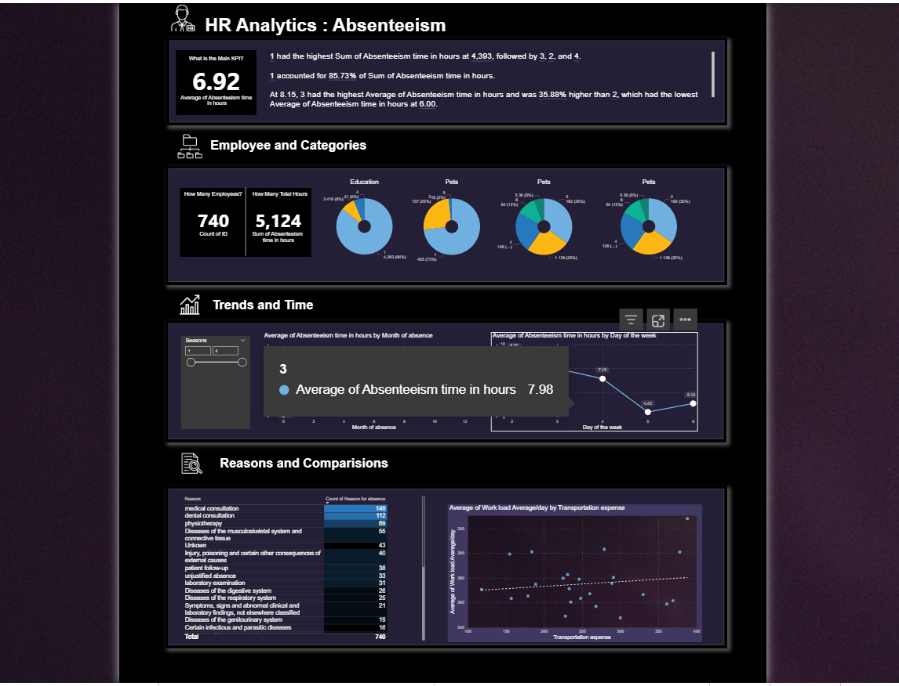

# Absenteeism & Wellness Dashboard

## Project Overview

An end-to-end **data analysis and visualization project** using **SQL and Power BI** to evaluate HR data on absenteeism and employee health. The project demonstrates how data-driven insights can inform **employee incentive programs and wellness initiatives**.


## Business Context

HR wanted a **data-driven approach** to:

* Identify healthy employees with low absenteeism for a **healthy bonus program**
* Calculate wage increases or annual compensation for non-smokers
* Provide a dashboard for **management to monitor absenteeism trends**

The project addresses **common HR challenges** with messy or disconnected datasets, creating a **centralized database** for analysis.


##  Workflow

1. **Database Setup**
  
   * Developed a **MySQL database**
   * Created tables and imported **three datasets**: `Absenteeism`, `Compensation` that contain information about salary, and `Reasons` with reasons for absence.
   * Data from multiple CSVs was imported and structured for analysis, ensuring consistency and integrity across tables.


2. **SQL Queries & Analysis**

   * Merged datasets for analysis
   * Queries include:

     * Identifying healthy individuals with low absenteeism
     * Calculating wage increase/annual compensation for non-smokers
     * Other analytical queries to answer HR-specific questions

*SQL Queries*

query to merge all three datasets into one for our analysis
```SQL
-- Merge absenteeism, compensation, and reasons datasets into a single dataset
CREATE VIEW vw_full_data AS
SELECT 
    a.*,
    c.`comp/hr` AS hour_rate,
    r.Reason,
    CASE 
        WHEN `Month of absence` IN (12, 1, 2) THEN 'Winter'
        WHEN `Month of absence` IN (3, 4, 5) THEN 'Spring'
        WHEN `Month of absence` IN (6, 7, 8) THEN 'Summer'
        WHEN `Month of absence` IN (9, 10, 11) THEN 'Autumn'
    END AS season,
    CASE 
        WHEN `Body mass index` < 18.5 THEN 'Underweight'
        WHEN `Body mass index` BETWEEN 18.5 AND 25 THEN 'Healthy'
        WHEN `Body mass index` BETWEEN 25 AND 30 THEN 'Overweight'
        WHEN `Body mass index` > 30 THEN 'Obese'
    END AS bmi_category,
    (SELECT AVG(`Absenteeism time in hours`) FROM absenteeism_at_work) AS avg_absenteeism
FROM absenteeism_at_work AS a
LEFT JOIN compensation AS c ON a.ID = c.ID
LEFT JOIN reasons AS r ON a.`Reason for absence` = r.Number;
```


query identifying the healthy individuals with low absenteeism
```SQL
-- Identify healthy employees with low absenteeism
SELECT ID
FROM vw_full_data
WHERE bmi_category = 'Healthy'
  AND `Absenteeism time in hours` < avg_absenteeism
  AND `social drinker` = 0
  AND `social smoker` = 0;
```

3. **Power BI Dashboard**

   * Connected directly to the database
   * Built an **interactive dashboard** with:

     * Employee categories
     * Absenteeism trends over time
     * Reasons and categories for absences


## Tools & Concepts

* **MySQL** – database creation, table design, data import
* **SQL** – queries, joins, aggregations, views, and analysis
* **Power BI** – interactive dashboards, visualizations, report building
* **Data Cleaning & Integration** – merging multiple datasets


## Key Insights & Findings


**Absenteeism Patterns**

* Average absenteeism across the workforce (740 employees) was 6.92 hours.
* Monday had the highest average absenteeism at 9.25 hours; Thursday the lowest at 4.45 hours — suggesting a possible "long weekend" effect worth further investigation.
* July recorded the highest monthly absenteeism, February the lowest.
* Seasonally, average absenteeism ranged narrowly from 6.00 to 8.15 hours, indicating absenteeism is driven more by day-of-week and specific months than by season.

**Reasons for Absence**

* Medical and dental consultations accounted for 261 of 740 recorded reasons (35.3%), the top two categories.

**Data Quality Flag**

* One employee accounted for 85.73% of total recorded absenteeism hours, an extreme outlier relative to the rest of the workforce. This was flagged for HR to verify whether it reflects a genuine case (e.g. long-term medical leave) or a data entry error, rather than being averaged into general trends.

**Healthy Bonus Program**

* 125 employees met all criteria (healthy BMI, below-average absenteeism, non-smoker, non-drinker) for the healthy bonus program. Against the $1,000 total budget, this works out to $8 per qualifying employee. The $8 per-employee bonus suggests the program budget may need revisiting relative to the number of qualifying employees.

**Non-Smoker Compensation Adjustment**

* 686 employees (out of 740) were identified as non-smokers. Against the $983,221 insurance budget, this equates to approximately $1,433 per non-smoker annually.


#### Power BI Dashboard 




