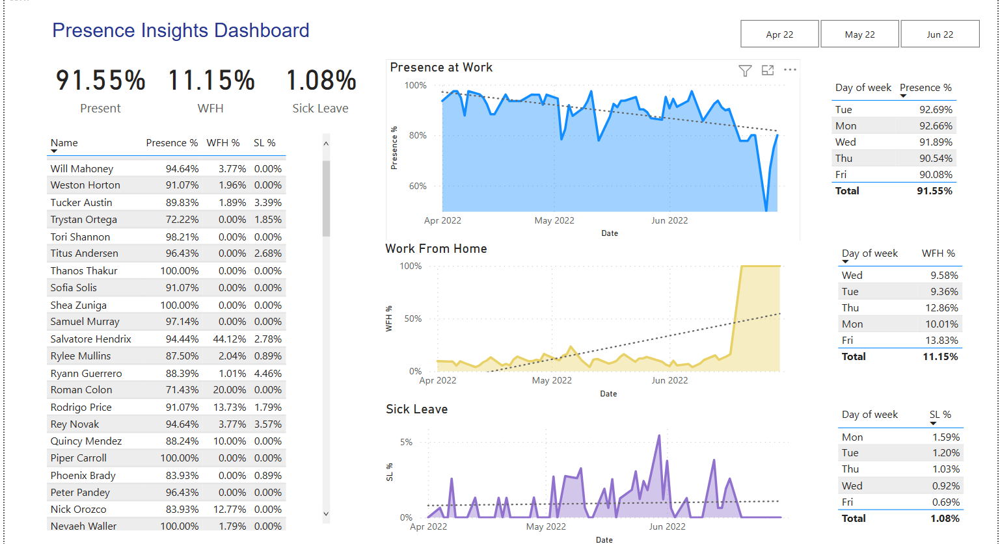
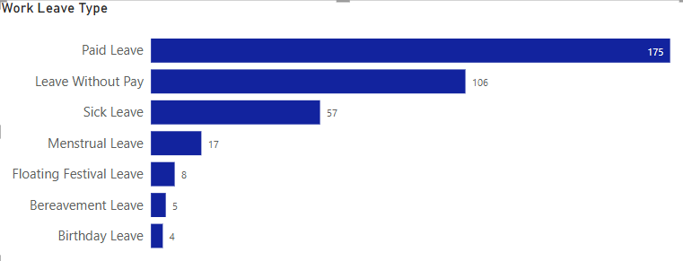

# 👨‍💼 Employee Presence Dashboard 

## Project Overview
This project analyzes employee attendance data over a period of three months, April to June, to gain insights into workforce presence and working preferences. The goal is to assist HR teams in understanding employee attendance patterns and making informed decisions regarding scheduling, remote work policies, and event planning.

## Dataset
The dataset represents an attendance sheet for employees, listing their workdays and specifying whether they were present or not and the type of day they had; work from home, hald day, holiday off, paid leave, and so on. 

## Tools Used
- **Power BI**: Used for data cleaning, transformation, and visualization

## Data Processing
1. **Data Cleaning**: Removed inconsistencies and standardized records.
2. **Data Transformation**: Converted raw attendance data into structured formats suitable for visualization.
3. **Dashboard Creation**: Built an intuitive dashboard in Power BI to display key metrics and insights.

## Dashboard Insights
The dashboard provides the following key insights:
- **Work Preferences**: Identifies whether employees prefer working from home or the office.
- **Attendance Trends**: Displays the percentage of employees present on specific days.
- **Event Planning Insights**: Helps in understanding the best time to schedule company-wide events based on attendance trends.

*Preview of dashboard*

## **Insights & Key Findings**  

#### **Attendance Trends**  
- The average attendance rate across the three months was about 91%, with the highest attendance in April at 94%  and the lowest in June at about 89%. The chart demonstrates a downward trend.

- Friday consistently had the lowest attendance, possibly indicating a trend in employee behavior.  

#### **Work Preferences**  
- About 11% of employees overall preferred working from home. It is observed from the dashboard, there was an upward trend each month with the numbers chnagng from 9% in April to 14% in June.

#### **Event Planning & Workforce Management**  
- The highest attendance was recorded on Mondays amd Tuesdays, making them the best time for company-wide events.

#### **Leave Patterns**  
- The most common type of leave was Paid Leave accounting for 47% of all recorded leaves, with Leave Without Pay coming in second at about 28% and sick leave third at 15%.

- There was a noticeable increase in sick leaves on Mondays, possibly due to extended weekends.  

