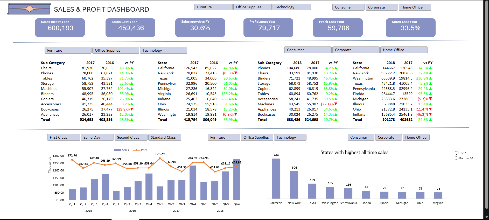

# Superstore Sales & Profit Dashboard (Excel)

## Project Overview
This project analyzes the Superstore dataset using Microsoft Excel. The primary goal was to clean, organize, and visualize the data to extract meaningful insights about sales, profits, and customer trends.

Key tasks completed in this project: 
- Perform data cleaning to handle missing values and inconsistencies.
- Conduct exploratory data analysis (EDA) to understand sales performance.
- Create pivot tables and charts to visualize key business metrics.
- Develop an interactive Excel dashboard for easy data interpretation.

### Tools Used
- Microsoft Excel
  - Pivot Tables
  - Charts and Graphs
  - Conditional Formatting
  - Data Cleaning Functions
  - Formulas (SUM, AVERAGE, COUNTIF, etc.)

### Dashboard Overview:
The dashboard presents key sales and profit metrics, segmented by different time periods, allowing users to analyze trends and performance at multiple levels.

**KPI Section:** Focuses on 2016 and 2017, showing sales, profit, and growth vs. the previous year.

**Subcategory & State Sales:** Compares 2016 vs. 2017 and 2017 vs. 2018 sales.

**Overall Trends & Top States:** Displays total revenue trends and top-performing states across all years.

*(Below is a snapshot of the Sales & Profit Dashboard, showcasing key insights and visualizations.)*

## **Insights & Key Findings**  

The insights provided below are based on the entire dataset, covering all available years. Users can explore different areas using the interactive filters in the dashboard. 

#### **1. Sales Performance**  
- **Top-Selling Categories:** Among the three main categories—**Technology, Furniture, and Office Supplies**—**Technology** generates the highest sales, followed by **Furniture**, with **Office Supplies** ranking last.  

- **Regional Sales Trends:** The West and East regions contribute the highest revenue, making them key markets for sales performance.  

- **Customer Segments:** The Consumer segment brings in the highest sales, followed by the Corporate segment, while the Home Office segment has the lowest sales.  

- **Shipping Mode & Sales Impact:** Standard Class shipping is the most preferred mode, driving the majority of sales.
This suggests that customers prioritize cost-effective shipping over faster options.  

#### **2. Profitability Analysis**  
- **Profitable vs. Unprofitable Products:** While **Technology** leads in sales, not all high-sales products are profitable. For example, the product **'TEC-MA-10002412'** ranks among the top three in sales but has a negative profit margin.  

- **Profit Margins by Category:**  
  - **Lowest profit subcategories:** Supplies, Bookcases, and Tables all have negative profit margins.  
  - **Highest profit subcategories:** Copiers, Phones, and Accessories generate the most profit.  
- **Regional Profitability:** The West and East regions, which rank highest in sales, also yield the highest profits.  
- **Seasonal Trends in Sales & Profit:**  
  - Sales exhibit a recurring pattern across multiple years.  
  - In Q1 and Q2, sales are generally lower, while Q3 and Q4 see a peak in sales and profit.  
  - This trend is consistent across years, suggesting a predictable sales cycle that could help with inventory and marketing planning.  

## Conclusion

This project demonstrates how Excel can be used to clean, analyze, and visualize business data effectively. The insights derived highlight key trends in sales, profitability, and customer behavior, providing valuable guidance for optimizing sales strategies, improving inventory management, and enhancing decision-making. By understanding regional performance, customer preferences, and seasonal trends, businesses can make more data-driven and strategic decisions to drive growth.

